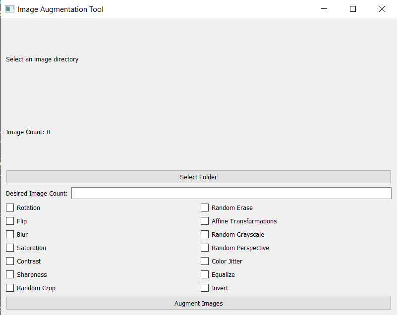

# AugmentImg 📚
 
AugmentImg is an open-source toolkit designed to enrich image datasets through advanced augmentation techniques, preserving the original size of the images. It is built with Python and provides a user-friendly GUI for ease of use, making it an ideal tool for anyone who runs out of enough data. 

## Application Interface

### Here's how AugmentImg User Interface looks like

 

## Features

- **Intuitive Graphical Interface**: Simplifies the augmentation process with a PyQt-based GUI.
- **Versatile Augmentations**: Includes a range of transformations such as flips, color jitters, rotations, and more.
- **Preservation of Image Dimensions**: Augments images without altering their original dimensions.
- **Supports Common Formats**: Works with popular image formats including PNG, JPEG, TIFF, BMP etc.

Checklist for Image Transformations
====================================

In the Image Augmentation Tool, users have the flexibility to select specific image transformations they wish to apply to their images. This feature is implemented through a user-friendly checklist within the graphical user interface (GUI), enabling tailored augmentation processes according to user preferences.

**Implementation Overview**:

The checklist is realized using PyQt5's `QCheckBox` widgets, each representing a different image transformation available in the torchvision library. Users can select or deselect these checkboxes to indicate which transformations they want to apply.

**Available Transformations**:

The tool provides a comprehensive set of image transformations, including but not limited to:

- **Rotation**: Rotate the image by a specified degree.
- **Flip**: Flip the image horizontally or vertically.
- **Blur**: Apply a Gaussian blur to the image.
- **Saturation**: Adjust the image's color saturation.
- **Contrast**: Modify the image's contrast level.
- **Sharpness**: Enhance or reduce the sharpness of the image.
- **Random Crop**: Crop random parts of the image.
- **Random Erase**: Randomly erase parts of the image.
- **Affine Transformations**: Apply affine transformations like scaling, translations, and rotations.

**How to Use the Checklist**:

1. **Select Folder**: Initially, users must select the folder containing the images they wish to augment.
2. **Choose Transformations**: Users can then go through the checklist and select the transformations they desire by clicking on the corresponding checkboxes.
3. **Specify Desired Image Count**: Users should enter the desired total count of images (original + augmented) in the provided input field.
4. **Augment Images**: By clicking the "Augment Images" button, the application will apply the selected transformations to the images in the chosen folder, generating augmented images until the desired count is reached.

**Technical Details**:

Upon initiating the augmentation process, the application dynamically constructs a transformation pipeline based on the selected options. This pipeline is then applied to each selected image, creating augmented versions which are saved to a designated subfolder within the original image directory.

This checklist approach not only enhances the tool's usability by providing control over the augmentation process but also allows for a wide range of augmentation combinations, catering to diverse requirements and preferences.

**Note**: The actual transformations applied may slightly vary depending on the specific settings and parameters chosen for each transformation type. You can still change them manually in augment.py file based on your requirements.

**For further information, please refer to the [documentation](docs/docs.rst) and if you are facing any issues you can refer to the possible [Img-not-supported](docs/errors.rst) error**


## Installation

Ensure you have Python 3.6+ installed, then clone the repository and install dependencies:

```bash
git clone https://github.com/zamalali/AugmentImg.git
cd AugmentImg
pip install -r requirements.txt
